<h1 align="center">Splitr</h1>

A sophisticated, dark-themed expense splitting app built with React, TypeScript, Vite, and Supabase. Track shared expenses across groups, calculate balances automatically, settle debts with minimal payments, and pay directly via UPI — works instantly as a guest, with optional account creation to save data permanently across devices.

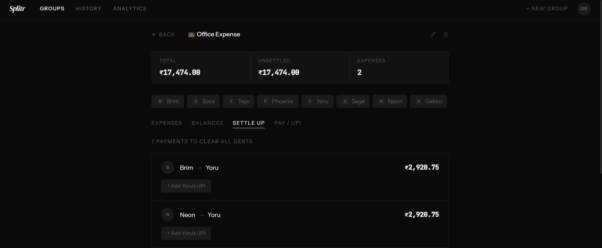


## Features

### Guest Mode — No Sign-up Required
- **Use immediately** — the app opens directly on the homepage with no login wall
- Create groups, add expenses, and track balances without an account
- Guest data is saved locally in the browser via `localStorage`
- **Seamless upgrade** — if you later create an account, all your guest groups and expenses are automatically migrated to your cloud account; nothing is lost

  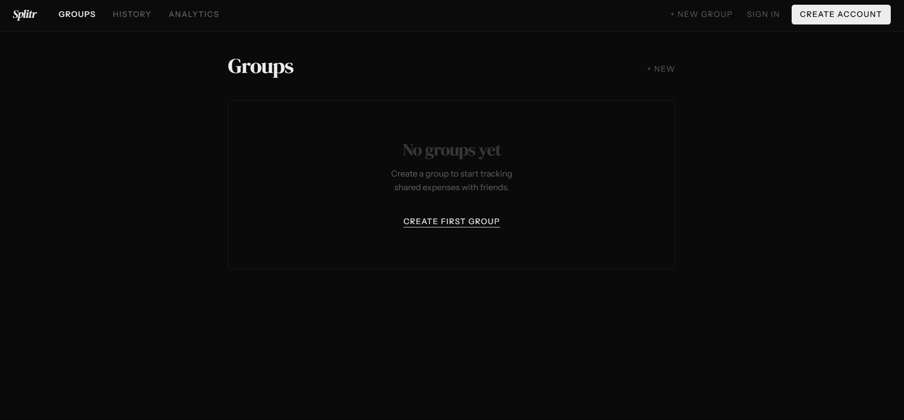

### Authentication
- **Sign in / Create account** buttons in the top-right navbar — visible to guests at all times
- Account creation and login via email and password, powered by **Supabase Auth** (bcrypt hashing; passwords never stored in your database)
- **Persistent sessions** — stay logged in across browser restarts via Supabase JWT session tokens
- Password strength indicator on registration
- Once signed in, the avatar dropdown replaces the auth buttons

  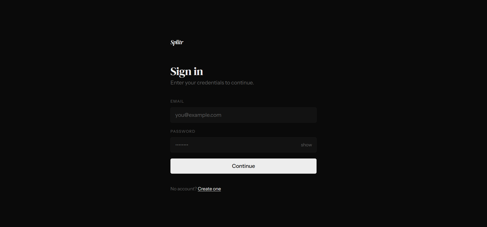

### Cloud Database (Supabase)
- All groups and expenses for authenticated users are stored in a **PostgreSQL database** on Supabase
- **Row Level Security (RLS)** enforced at the database level — each user can only ever read or write their own data
- **Optimistic updates** — the UI updates instantly on every action; changes are synced to the database in the background
- Data persists across all devices and browsers when signed in
- Guest data lives in `localStorage` and is automatically migrated to Supabase on first sign-up

  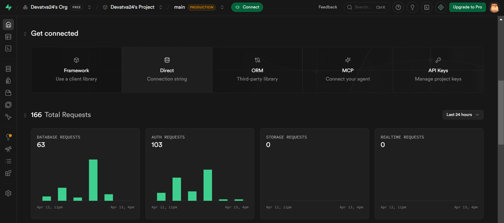

### Groups
- Create named groups with a custom emoji icon and any number of members
- **Edit** group name and emoji inline at any time
- Delete a group along with all its expenses
- Member avatars with stacked initials shown on the groups list

  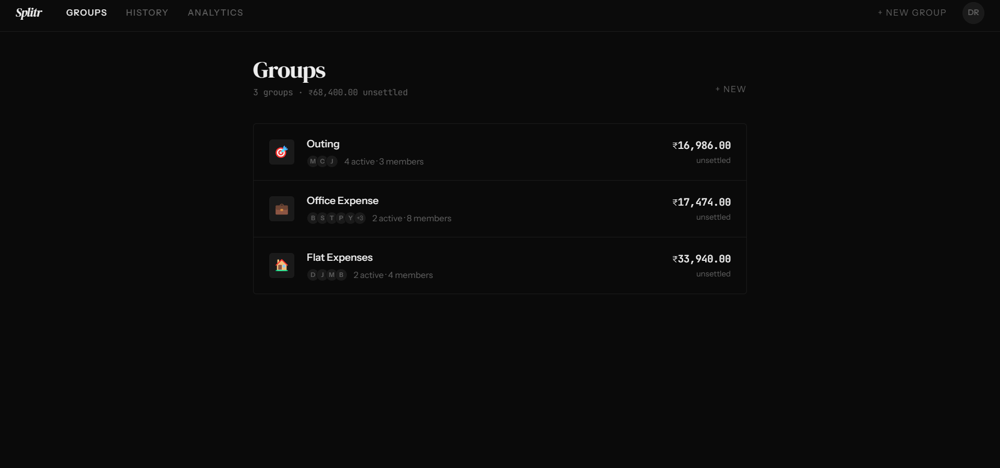

### Expenses
- Add expenses with description, amount, payer, split members, and category
- Categories: General, Food & Drink, Transport, Stay, Entertainment, Shopping, Utilities
- **Edit any expense** inline — update description, amount, payer, or who it's split among; edits are timestamped
- Mark individual expenses as settled or unsettled
- Delete expenses with a confirmation prompt
- Per-person split amount shown automatically

  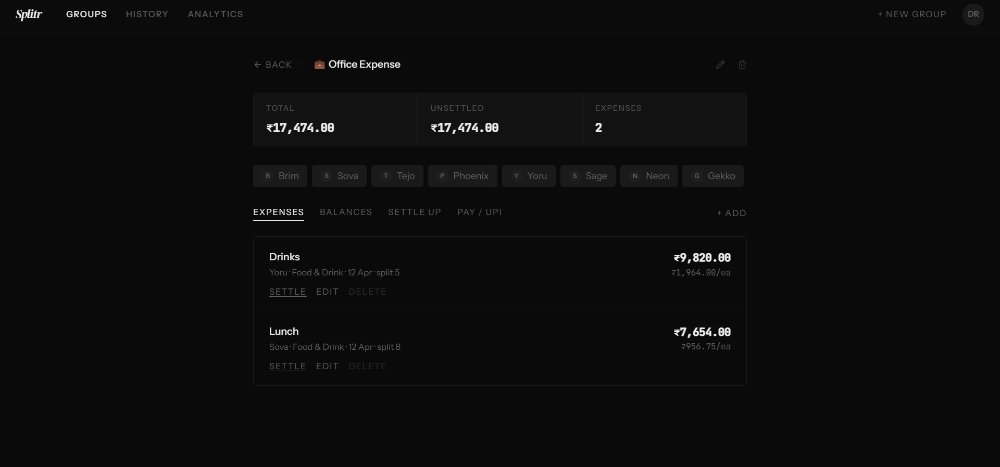

### Balances & Settle Up
- Real-time balance calculation per member across all unsettled expenses
- **Minimum payments algorithm** — computes the fewest transactions needed to fully settle a group
- Visual balance bars showing relative magnitude of each person's position

  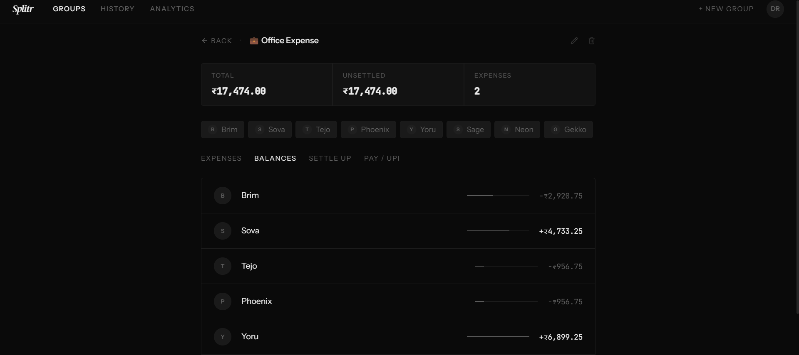

### UPI & Payments
- Save a UPI ID and phone number for each group member under the **Pay / UPI** tab
- **One-tap UPI payment** — generates a `upi://pay` deep-link pre-filled with the correct amount; opens any UPI app (GPay, PhonePe, Paytm, etc.) directly
- **WhatsApp reminder** — generates a pre-written reminder message with the pending amount; opens WhatsApp Web or the app
- Show the payee's UPI ID inline for manual payments
- Pending amount auto-calculated per member from unsettled expenses

  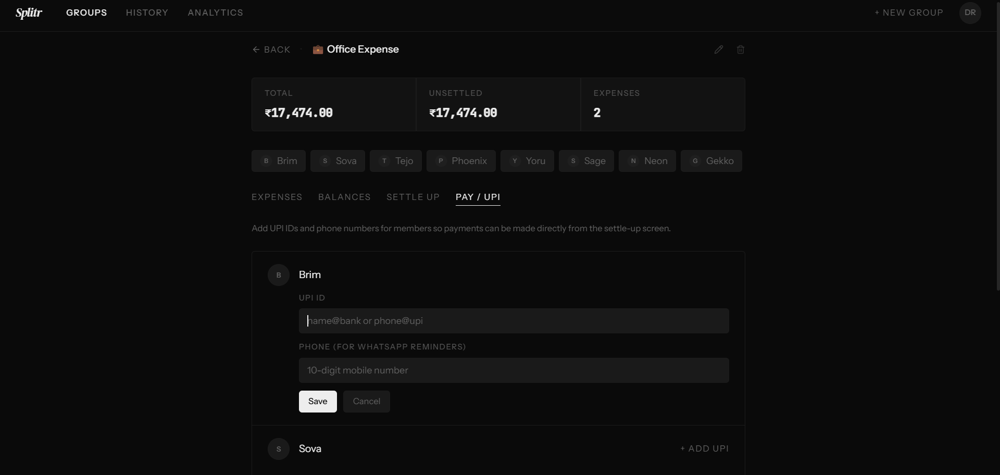

### History
- Chronological list of all expenses across every group
- Filter by group with one click
- Shows total amount and transaction count for the current filter

  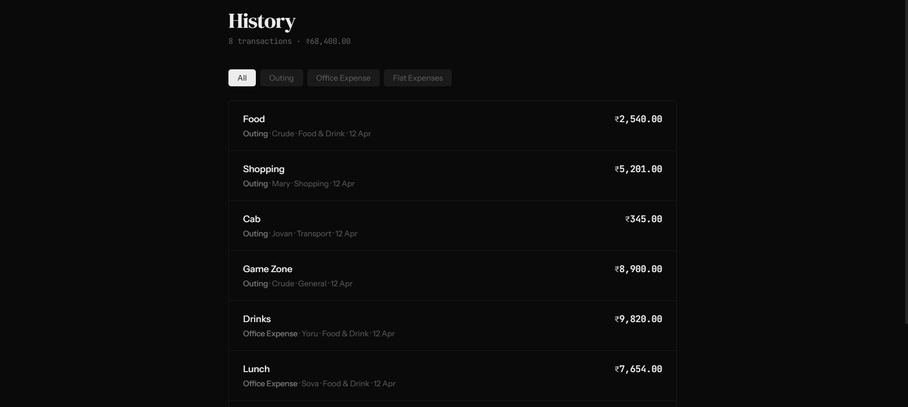

### Analytics
- Key metrics: total tracked, settled amount, average expense, settlement percentage
- Spending breakdown by group with relative bar charts
- Spending breakdown by category
- Top payers ranked by total amount paid

  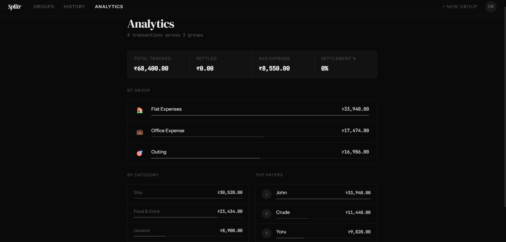

### Design
- Monochromatic dark theme — pure blacks, whites, and grays only; no color noise
- **DM Serif Display** for editorial headings, **Instrument Sans** for body text, **JetBrains Mono** for all numbers
- Hairline `1px` borders define structure; no decorative shadows or gradients
- Custom SVG favicon — a minimal split mark matching the app's aesthetic
- Fully responsive — top navbar on desktop, bottom tab bar on mobile
- Smooth fade-in transitions on page and list loads
- Profile dropdown closes on any click outside it

---

## Tech Stack

| Layer | Technology |
|---|---|
| Framework | React 18 |
| Language | TypeScript 5 |
| Build tool | Vite 5 (SWC) |
| Routing | React Router DOM v6 |
| Styling | Tailwind CSS v3 |
| UI primitives | Radix UI (via shadcn/ui) |
| State management | React Context + `useState` |
| Auth | Supabase Auth (email/password, JWT) |
| Database | Supabase (PostgreSQL + Row Level Security) |
| Guest persistence | `localStorage` |
| Testing | Vitest + Testing Library |

---

## Project Structure

```
src/
├── App.tsx                        # Root — providers, routing, guest-first flow
│
├── contexts/
│   ├── AuthContext.tsx            # Auth state shared across the app
│   └── StoreContext.tsx           # Global expense store (single reactive instance)
│
├── hooks/
│   ├── useAuthStore.ts            # register / login / logout via Supabase Auth
│   └── useExpenseStore.ts         # Groups, expenses, balances, UPI — guest + cloud logic
│
├── lib/
│   ├── supabase.ts                # Supabase client singleton
│   └── utils.ts                   # Tailwind merge helper
│
├── pages/
│   ├── Index.tsx                  # Groups list + group detail view
│   ├── History.tsx                # Cross-group expense history with filters
│   ├── Analytics.tsx              # Spending analytics and charts
│   ├── Login.tsx                  # Sign-in page
│   ├── Register.tsx               # Account creation page
│   └── NotFound.tsx               # 404
│
├── components/
│   ├── Navbar.tsx                 # Top nav + mobile bottom bar + guest auth buttons
│   ├── GroupDetail.tsx            # Expenses / Balances / Settle Up / UPI tabs
│   ├── AddExpenseDialog.tsx       # Modal — add a new expense
│   ├── NewGroupDialog.tsx         # Modal — create a new group
│   ├── ConfirmDialog.tsx          # Generic confirmation dialog
│   ├── ProtectedRoute.tsx         # Loading state handler (no hard redirect for guests)
│   ├── NavLink.tsx                # React Router NavLink wrapper
│   └── ui/                        # shadcn/ui primitives (Dialog, AlertDialog, etc.)
│
├── index.css                      # CSS variables (dark theme) + font imports
└── main.tsx                       # React DOM entry point
```

---

## Getting Started

### Prerequisites

- Node.js 18 or later
- npm 9 or later
- A free [Supabase](https://supabase.com) project

### 1. Clone and install

```bash
git clone https://github.com/Devatva24/Splitr.git
cd Splitr
npm install
```

### 2. Set up Supabase

1. Create a new project at [supabase.com](https://supabase.com)
2. Go to **SQL Editor** → **New query**, paste the contents of `supabase/schema.sql`, and click **Run**
3. Go to **Project Settings → API** and copy your **Project URL** and **anon / public** key

### 3. Configure environment variables

```bash
cp .env.example .env.local
```

Fill in your values in `.env.local`:

```
VITE_SUPABASE_URL=https://your-project-ref.supabase.co
VITE_SUPABASE_ANON_KEY=your-anon-key-here
```

### 4. Run the dev server

```bash
npm run dev
```

The app runs at `http://localhost:8080` by default.

### Other commands

```bash
npm run build        # Production build → dist/
npm run preview      # Preview the production build locally
npm run lint         # ESLint
npm run test         # Run tests once
npm run test:watch   # Run tests in watch mode
```

---

## Deployment (Vercel)

1. Push to GitHub
2. Import the repo on [vercel.com](https://vercel.com)
3. Go to **Settings → Environment Variables** and add `VITE_SUPABASE_URL` and `VITE_SUPABASE_ANON_KEY` (tick Production, Preview, and Development for each)
4. Redeploy

---

## Data Storage

| User type | Where data lives |
|---|---|
| Guest (not signed in) | Browser `localStorage` under `splitr_data_v5_guest` |
| Authenticated | Supabase PostgreSQL database, scoped to `user_id` via RLS |

When a guest registers, their local groups and expenses are automatically migrated to Supabase and the local copy is cleared.

---

## UPI Integration

The UPI payment flow uses the standard `upi://` deep-link URI scheme supported by all major Indian UPI apps.

**Link format:**
```
upi://pay?pa={upiId}&pn={payeeName}&am={amount}&cu=INR&tn={note}
```

When a member's UPI ID is saved, the Settle Up tab generates this link pre-filled with the exact settlement amount. Tapping it opens the default UPI app on the device.

**WhatsApp reminders** open `https://wa.me/91{phone}?text={message}` with a pre-written message containing the pending amount.

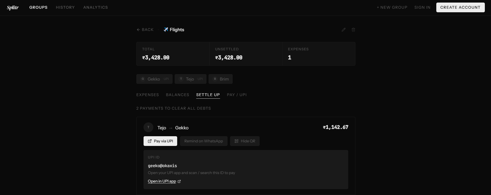

---

## Architecture Notes

### Guest-first flow

The app requires no authentication to use. `useExpenseStore` checks whether a `userId` is present — if not, it reads and writes directly to `localStorage`. Once the user signs in, the hook switches to Supabase and any guest data is migrated automatically. The navbar always shows **Sign in** and **Create account** to guests, and the avatar dropdown to authenticated users.

### Why a global StoreContext?

The expense store (`useExpenseStore`) holds all group and expense state in React `useState`. If multiple components each call the hook independently, they each get their own isolated state instance — changes in one don't reflect in others.

`StoreContext` solves this by instantiating the store once at the `AppRoutes` level and distributing it via React Context. Every component — `Navbar`, `Index`, `History`, `Analytics`, `GroupDetail` — calls `useStore()` and reads from the same reactive instance. Add a group anywhere → the navbar counter, the groups list, history, and analytics all update simultaneously.

### Settlement algorithm

The minimum-payment algorithm runs in O(n log n):

1. Compute net balance per member (positive = owed money, negative = owes money)
2. Sort debtors ascending, creditors descending
3. Greedily match largest debtor to largest creditor, record a transaction for `min(|debtor|, creditor)`, adjust both balances
4. Repeat until all balances are within ±0.005 (floating-point tolerance)

This produces the fewest possible transactions to fully settle a group.

---

## Roadmap

- [x] Cloud sync / multi-device support (Supabase backend)
- [x] Guest mode with automatic data migration on sign-up
- [ ] Recurring expenses
- [ ] Expense photos / receipt attachments
- [ ] CSV / PDF export
- [ ] Push notifications for pending payments
- [ ] Multi-currency support
- [ ] Native mobile app (React Native)
